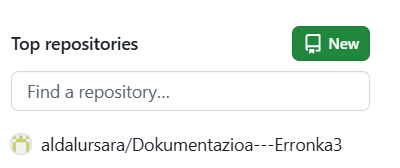

Erronkaren bigarren faseko helburu-nagusia datu-basea ingurune lokaletik hodeira (Cloud) migratzea da, MongoDB Atlas zerbitzua erabiliz, eta ondoren, adimen artifiziala eta datuen bistaratzea lantzea da.

Hasteko, github-en repositorio bat sortu dugu.

